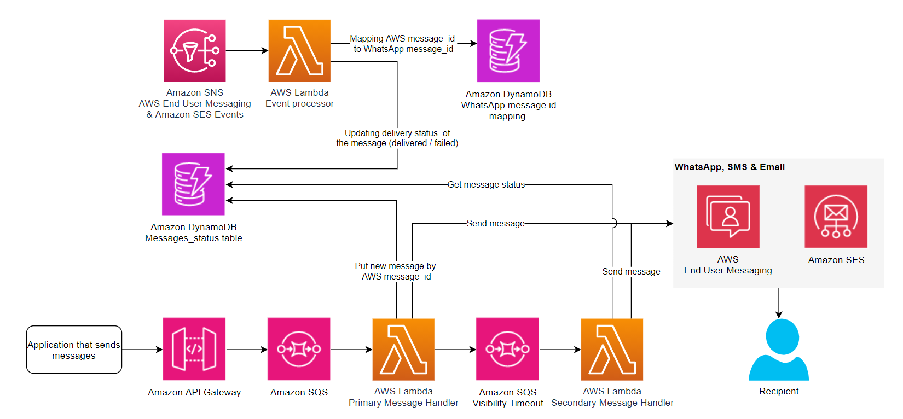

# Omnichannel Fallback Solution

A repository for a Omni-channel Fallback solution that uses Amazon API Gateway, AWS Lambda, Amazon Simple Email Service (SES), and AWS End User Messaging.

## Solution info:

Users can send Email, SMS or WhatsApp messages as the primary and fallback channels using the API Gateway endpoint. The payload specifies the primary and fallback channel as well as sender, receiver addresses, message and how much time (fallback_seconds) the solution will wait for a successful delivery before it sends the message using the secondary channel.

## Architecture



- **Amazon API Gateway:** This exposes an API endpoint secured by an API key to send messages via multiple channels (Email, SMS and WhatsApp). The user sends the message payload with details of the primary and fallback channels via this gateway.

- **Amazon SQS (Simple Queue Service):** Messages received by the API Gateway are placed into a queue in SQS. This ensures that messages are processed asynchronously and reliably, even during traffic spikes or when the system is busy.

- **AWS Lambda (Primary Message Handler):** This Lambda function is triggered by SQS. It retrieves the message from the SQS queue and sends it via the primary channel (Email, SMS or WhatsApp). The primary handler also tracks the message status and logs it in DynamoDB.

- **Amazon SQS Visibility Timeout:** This configuration ensures that a message remains invisible in the queue for a certain period (specified in the API request body) while the primary handler attempts to deliver it. If delivery fails or times out, the message becomes visible again for retry or fallback.

- **AWS Lambda (Secondary Message Handler):** If the primary message fails or a fallback period elapses, this Lambda function semds the message received from SQS, via the fallback channel. This ensures message delivery even if the primary channel fails.

- **Amazon SNS (Simple Notification Service):** SNS plays a key role in tracking message events. It captures success or failure events related to the message's delivery (such as delivered, bounced, or failed) for Email, SMS and WhatsApp. These events are forwarded to the Lambda Event Processor for further handling. Each channel has its own Lambda function but for simplicity the architecture diagram groups them under **Event Processor**.

- **AWS Lambda Event Processor:** This function is triggered by SNS and processes delivery status updates. It updates the status of each message (delivered, failed) in DynamoDB and also maps AWS message IDs to WhatsApp message IDs for tracking WhatsApp messages.

- **Amazon DynamoDB (WhatsApp Message ID Mapping Table):** This DynamoDB table stores mappings between AWS message IDs and WhatsApp message IDs. Since the WhatsApp API returns its own message IDs, this mapping helps the solution track status updates across different platforms.

- **Amazon DynamoDB (Messages Status Table):** This table stores the delivery status of all messages, including whether the message was delivered, failed, or is pending fallback. It is updated by the Lambda Event Processor based on events received from SNS.

### Prerequisites:

1. Have at least one verified SES sending identity and if you are in the SES sandbox, one verified email address for receiving.

### Deployment:

Follow the deployment and test steps in the [Deployment Guide](Deployment_Guide.md)

### Send messages payload:

Below you can find the API request body and explanation for each field:

```
{
    "use_case": "<fallback or broadcast>",
    "fallback_seconds":"<number of seconds until fallback channel>",
    "pc": {
        "channel": "<sms/whatsapp/email>",
        "sender": "<phone pool/phone number id/email>",
        "recipient":"<phone number or email>",
        "email": {
            "subject": "<email subject>",
            "text": "<text>",
            "html": "<html>",
            "template": "<SES template name>",
            "configuration_set": "<configuration set name>"
        },
        "sms": {
            "message": "<the SMS content>",
            "message_type": "<PROMOTIONAL/TRANSACTIONAL>",
            "configuration_set": "<configuration set name>"
        },
        "whatsapp": {
            "message": "<the Whatsapp message content>",
        }
    },
    "fc": {
        "channel": "<sms/whatsapp/email>",
        "sender": "<phone pool/phone number id/email>",
        "recipient":"<phone number or email>",
        "email": {
            "subject": "<email subject>",
            "text": "<email body text>",
            "html": "<email body html>",
            "template": "<SES template name>",
            "configuration_set": "<configuration set name>"
        },
        "sms": {
            "message": "<the SMS content>",
            "message_type": "<PROMOTIONAL/TRANSACTIONAL>",
            "configuration_set": "<configuration set name>"
        },
        "whatsapp": {
            "message": "<the Whatsapp message content>",
        }
    }
}
```

- **use_case (mandatory)**: This takes two values **fallback** or **broadcast**. Fallback will send the message using the primary channel and if there is no successful delivery event after the specified **fallback_seconds** period, it will send the message using the fallback channel. The blast option sends from both the primary and fallback channels at the same time.

- **fallback_seconds (optional)**: Specifies how many seconds the solution should wait for successful message delivery from the primary channel before sending the message using the fallback channel.

- **pc (mandatory)**: PC stands for primary channel and it is the first channel the solution uses to send the message. This object is required even if the **use_case** is **blast**.

  - **channel (mandatory)**: Takes one of the following three values: **sms**, **whatsapp**, or **email**. Depending on the choice, the solution will use the respective API to send the message.
  - **sender (mandatory)**: The sender value depends on the channel. **SMS** takes the value of the originating identity or phone pool ID, **WhatsApp** takes the phone number, and **Email** takes the email address. When selecting SMS or WhatsApp, ensure the phone number is in E164 format: <+country_code><phone_number>. To retain the "+" symbol in URLs, replace it with "%2B". For example, "+44" should be encoded as "%2B44".
  - **recipient (mandatory)**: The recipient value depends on the channel. **SMS** and **WhatsApp** take the phone number, and **Email** takes a valid email address.

  - **email (optional)**: The email object contains fields specific to email communication.

    - **subject (mandatory for Email)**: The subject line of the email.
    - **text (optional)**: The plain text version of the email body.
    - **html (optional)**: The HTML version of the email body.
    - **template (optional)**: The name of the SES (Simple Email Service) template to be used for the email.
    - **configuration_set (optional)**: The configuration set name for event tracking. It allows the user to specify the events they want to track (e.g., delivery, bounce, complaint) and where to send them. This is essential for fallback logic but optional here, as it can be set at a higher level in SES.

  - **sms (optional)**: The SMS object contains fields specific to SMS communication.
    - **message (mandatory for SMS)**: The content of the SMS.
    - **message_type (mandatory for SMS)**: The type of SMS message, which can be **PROMOTIONAL** or **TRANSACTIONAL**.
    - **configuration_set (mandatory)**: The configuration set name for event tracking. This field is critical for ensuring the solution can properly track delivery or failure events to decide whether to trigger the fallback channel.

  - **whatsapp (optional)**: The WhatsApp object contains fields specific to WhatsApp communication.
    - **message (mandatory for WhatsApp)**: The content of the WhatsApp message.

- **fc (mandatory)**: FC stands for fallback channel and is used if the primary channel fails to deliver the message successfully after the specified **fallback_seconds** period. This object is required even if the **use_case** is **broadcast**. The structure of this object is the same as **pc**.

## Configuration Options

This project uses a `config.params.json` file to specify various configuration options. You can customize the following options according to your requirements:

### SES Configuration Options

1. **configSetName** (string): The name of the Amazon SES configuration set to be created. This configuration set will be used to monitor email sending events.

2. **createSESConfigSet** (boolean): A flag to control whether the Amazon SES configuration set should be created or not. Set this to `true` if you want to create the configuration set, or `false` to skip its creation.

If `createSESConfigSet` is set to `true`, the project will create an Amazon SES configuration set with the name specified in `configSetName`. This configuration set will monitor the following email sending events:

- Send
- Rendering Failure
- Reject
- Delivery
- Hard Bounce
- Complaint
- Delivery Delay
- Subscription
- Open
- Click

These events will be published to an Amazon SNS topic named `EUMEvents`.

If `createSESConfigSet` is set to `false`, the Amazon SES configuration set and the associated event monitoring will not be created.

### SMS Configuration Options

1. **smsConfigSetName** (string): The name of the Amazon SMS configuration set to be created. This configuration set will be used to monitor SMS sending events.

2. **createSMSConfigSet** (boolean): A flag to control whether the Amazon SMS configuration set should be created or not. Set this to `true` if you want to create the configuration set, or `false` to skip its creation.

If `createSMSConfigSet** is set to `true`, the project will create an Amazon SMS configuration set with the name specified in `smsConfigSetName`. This configuration set will monitor the following SMS sending events:

- All SMS Events (Send, Delivery, Bounce, etc.)

These events will be published to the Amazon SNS topic specified in the environment variable `SNS_TOPIC_ARN`.

If `createSMSConfigSet` is set to `false`, the Amazon SMS configuration set and the associated event monitoring will not be created.
